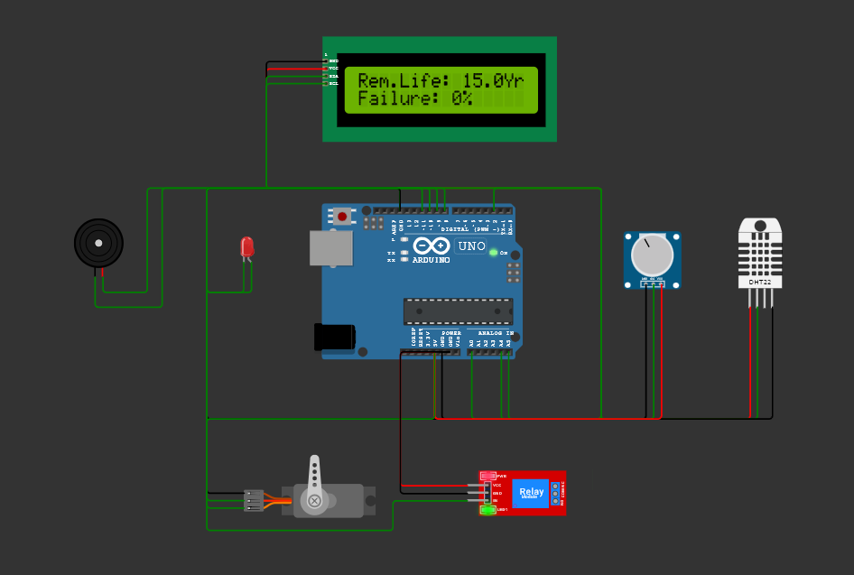

# AI-Based Predictive Transformer Health Monitoring and Preventive Protection System Using Arduino UNO

<p align="center">

</p>

<p align="center">
An intelligent transformer monitoring system using Arduino UNO for health prediction, risk classification, automatic cooling control, and preventive protection.
</p>

---

<p align="center">


</p>

---

# Overview

Transformer is one of the most important components in electrical power systems. Unexpected transformer failures can lead to power interruption, equipment damage, and increased maintenance costs.

This project presents an **AI-Based Predictive Transformer Health Monitoring and Preventive Protection System using Arduino UNO**.

The system continuously monitors transformer temperature and load conditions. The collected parameters are processed by Arduino UNO to calculate a **Transformer Health Score**, estimate failure probability, and classify the transformer risk level.

The system provides automatic cooling control, relay-based protection, LED indication, buzzer alert, and real-time monitoring through a 16×2 I2C LCD display.

---

# Objectives

* To monitor transformer temperature in real time.
* To simulate transformer load variations.
* To calculate transformer Health Score.
* To predict transformer operating condition.
* To estimate failure probability.
* To provide automatic cooling control.
* To implement preventive protection during critical conditions.

---

# Features

* Real-time temperature monitoring
* Load condition monitoring
* AI-based Health Score calculation
* Failure probability estimation
* Remaining life estimation
* Risk level classification
* Automatic cooling control using servo motor
* Relay-based protection system
* LED warning indication
* Buzzer alert system
* Fault counting mechanism
* LCD dashboard monitoring

---

# Hardware Components

| Component                | Purpose                            |
| ------------------------ | ---------------------------------- |
| Arduino UNO              | Main processing controller         |
| DHT22 Temperature Sensor | Transformer temperature monitoring |
| Potentiometer            | Load condition simulation          |
| 16×2 I2C LCD Display     | Real-time status display           |
| Servo Motor              | Cooling system simulation          |
| Relay Module             | Protection control                 |
| LED                      | Warning indication                 |
| Buzzer                   | Audio alert                        |

---

# Software Requirements

| Software        | Purpose                      |
| --------------- | ---------------------------- |
| Arduino IDE     | Embedded program development |
| Wokwi Simulator | Circuit simulation           |
| GitHub          | Project documentation        |

---

# System Architecture

The proposed system consists of the following modules:

* Temperature Monitoring Module
* Load Monitoring Module
* Health Score Calculation Module
* Risk Prediction Module
* Cooling Control Module
* Protection Module
* LCD Display Module

<p align="center">

</p>

---

# Working Principle

1. DHT22 sensor measures transformer temperature.
2. Potentiometer provides simulated load values.
3. Arduino UNO receives sensor data.
4. Temperature and load values are processed.
5. Transformer Health Score is calculated.
6. Risk level is classified.
7. Cooling and protection actions are automatically controlled.
8. LCD displays transformer health information.

---

# Health Score Calculation

The transformer condition is represented using a Health Score ranging from **0 to 100**.

The Health Score depends on:

* Temperature condition
* Load condition
* Abnormal operating conditions

A higher Health Score represents better transformer health.

---

# Risk Classification

| Health Score | Risk Level    |
| ------------ | ------------- |
| 80 - 100     | LOW Risk      |
| 50 - 79      | MEDIUM Risk   |
| 25 - 49      | HIGH Risk     |
| Below 25     | CRITICAL Risk |

---

# Protection Mechanism

## LOW Risk

* Normal operation
* Cooling system OFF
* No alert indication

## MEDIUM Risk

* Increased monitoring
* Cooling assistance activated

## HIGH Risk

* Cooling system ON
* Warning indication activated

## CRITICAL Risk

* Relay protection activated
* Buzzer alert enabled
* Fault condition recorded

---

# Circuit Diagram

<p align="center">

</p>

---

# Flowchart

<p align="center">

</p>

---

# Simulation

The project is simulated using the Wokwi online simulation platform.

Simulation Link:

https://wokwi.com/projects/469066635947975681

---

# LCD Monitoring Output

## Normal Condition

<p align="center">

</p>

---

## Transformer Status

<p align="center">

</p>

---

## Prediction Output

<p align="center">

</p>

---

## Critical Condition

<p align="center">

</p>

---

# Results

The developed system was tested under different transformer operating conditions.

The system successfully performs:

* Temperature monitoring
* Load analysis
* Health Score calculation
* Risk classification
* Failure prediction
* Cooling control
* Relay protection
* Alert generation

---

# Test Results

## Normal Condition

* Health Score remains high.
* Risk level: LOW
* Cooling system: OFF
* Protection: Normal

<p align="center">

</p>

---

## Status Monitoring Condition

* Real-time transformer parameters are displayed.
* Temperature and load conditions are monitored.

<p align="center">

</p>

---

## Prediction Condition

* Health Score is calculated.
* Risk level is predicted.
* Failure probability is estimated.

<p align="center">

</p>

---

## Critical Condition

* Critical risk detected.
* Cooling activated.
* Relay protection enabled.
* Alarm generated.

<p align="center">

</p>

---

# Repository Structure

```text
AI-Based-Transformer-Health-Monitoring-System
│
├── Arduino_Code
│   └── AI_Transformer_Health_Monitoring.ino
│
├── Documentation
│   ├── Project_Report.pdf
│   ├── Abstract.md
│   └── Methodology.md
│
├── Images
│   ├── Project_Banner.png
│   ├── Block_Diagram.png
│   ├── Circuit_Diagram.png
│   ├── Flowchart.png
│   ├── LCD_Normal.png
│   ├── LCD_Status.png
│   ├── LCD_Prediction.png
│   └── LCD_Critical.png
│
├── Results
│   ├── Test_Result.md
│   ├── Test_Result_1_Normal.png
│   ├── Test_Result_2_Status.png
│   ├── Test_Result_3_Prediction.png
│   └── Test_Result_4_Critical.png
│
├── Simulation
│   └── Wokwi Simulation Link
│
├── README.md
└── LICENSE
```

---

# Arduino Code

The complete Arduino source code is available in:

```text
Arduino_Code/
└── AI_Transformer_Health_Monitoring.ino
```

---

# Future Improvements

* IoT-based remote monitoring
* Mobile application integration
* Cloud data storage
* Machine Learning prediction model
* Real transformer data analysis
* Wireless communication system
* Advanced fault diagnosis

---

# Conclusion

The **AI-Based Predictive Transformer Health Monitoring and Preventive Protection System Using Arduino UNO** provides an efficient and low-cost solution for transformer condition monitoring.

The system continuously analyzes temperature and load conditions, predicts transformer health status, and provides preventive protection through automatic cooling and relay operation.

This project demonstrates the application of intelligent monitoring techniques in electrical power systems.

---

# Author

**Karthikeyan M**

Department of Electrical and Electronics Engineering

V.S.B College of Engineering Technical Campus

Anna University

Academic Year: **2023–2027**

---

# License

This project is licensed under the **MIT License**.

You are free to use, modify, and distribute this project for educational and research purposes with proper credit to the original author.
