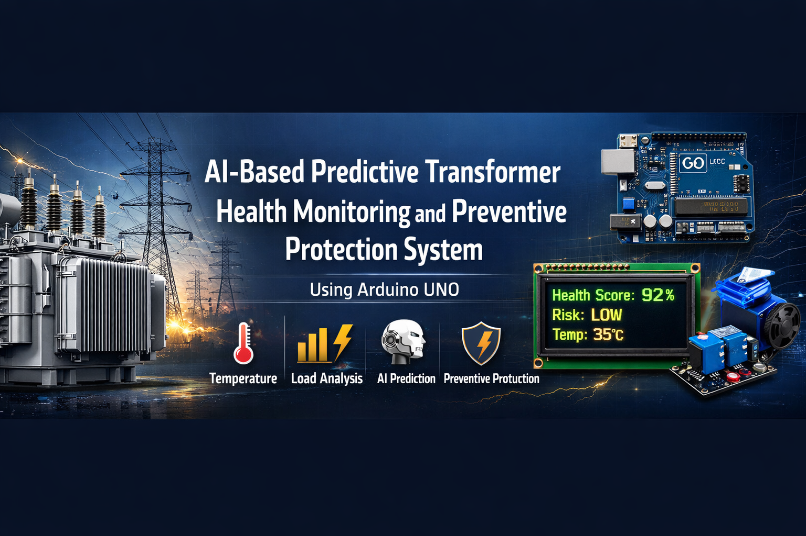
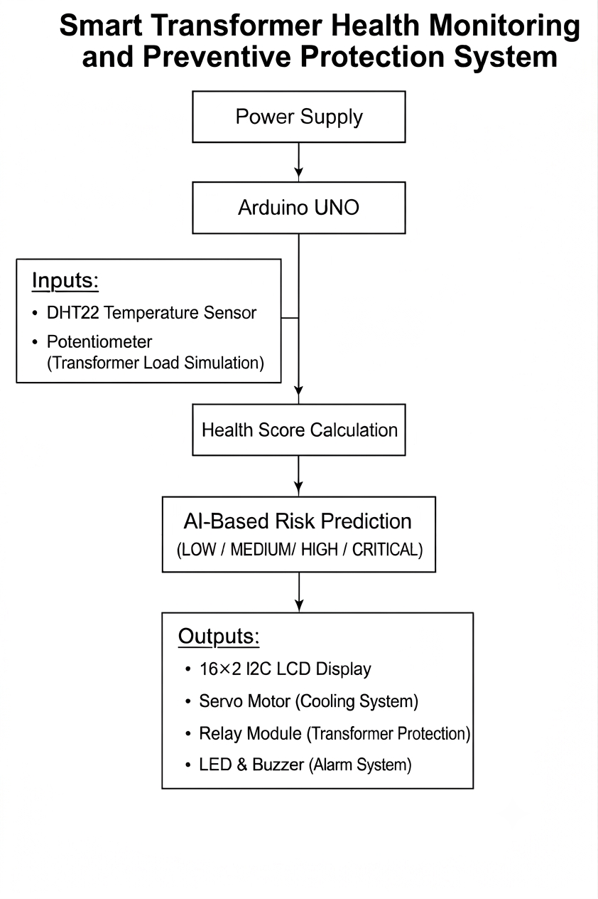
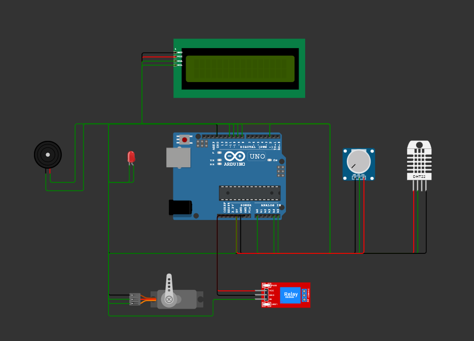
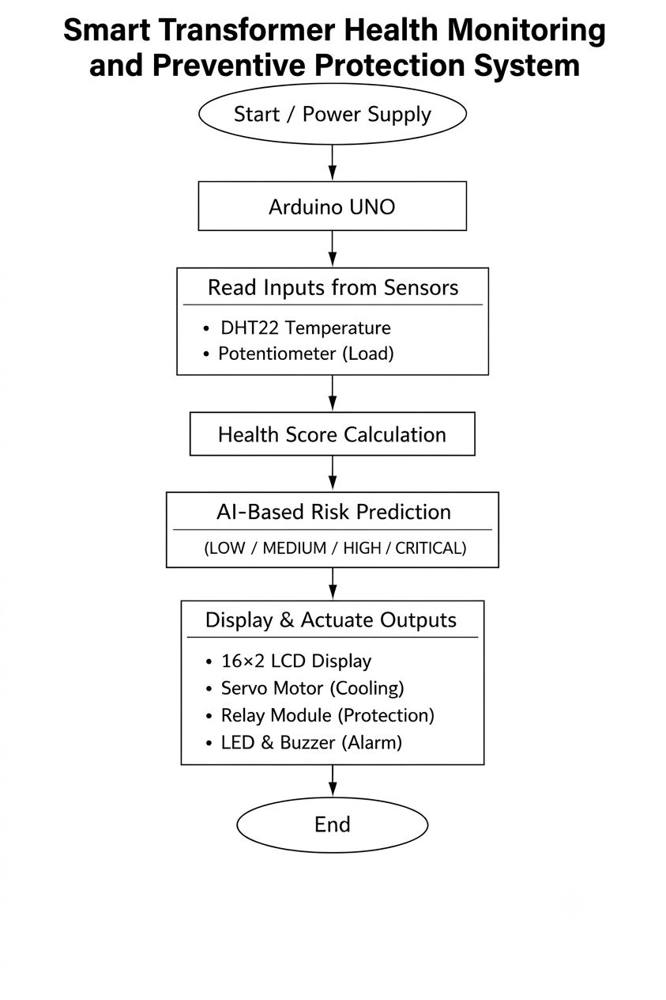
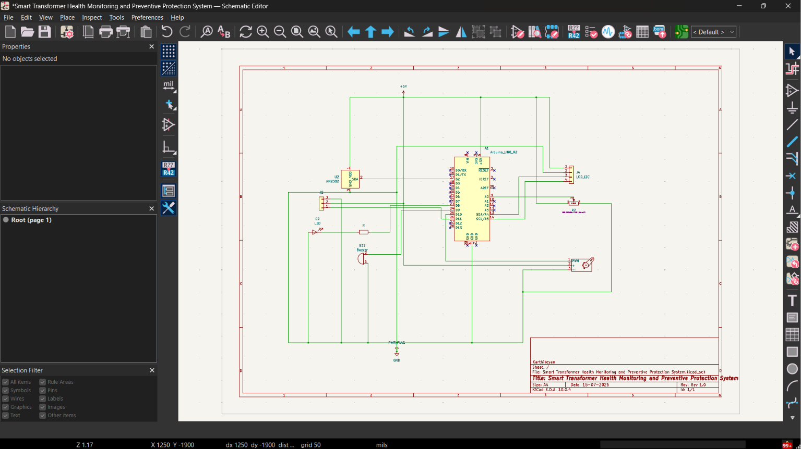
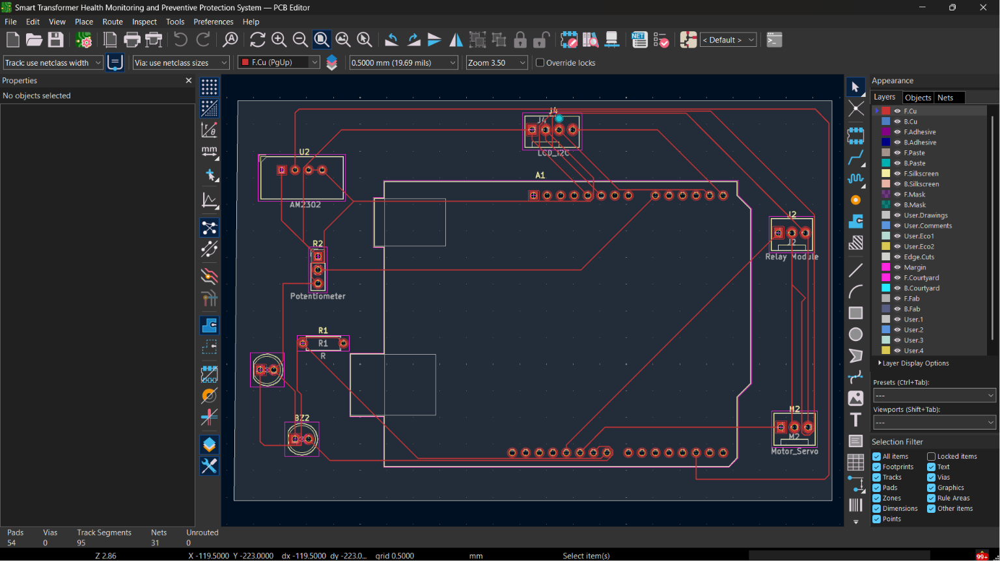
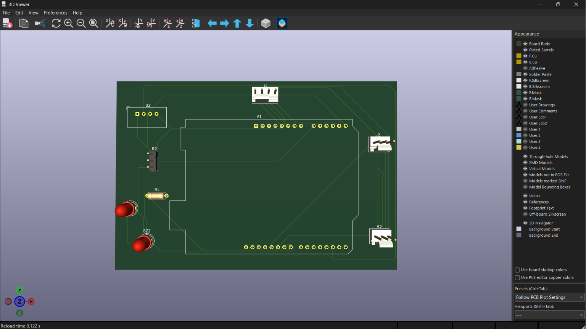
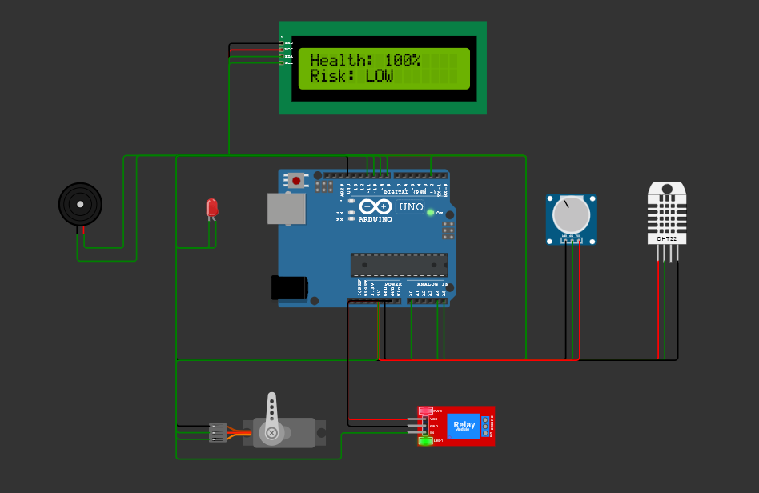
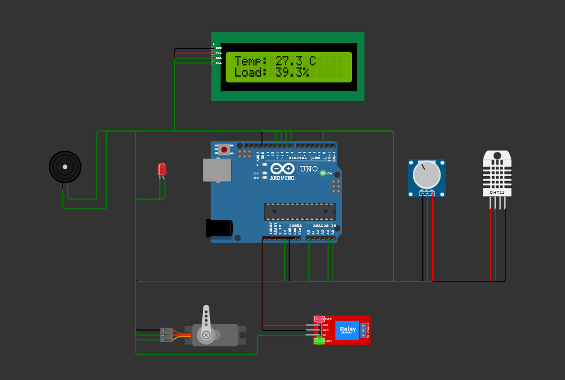
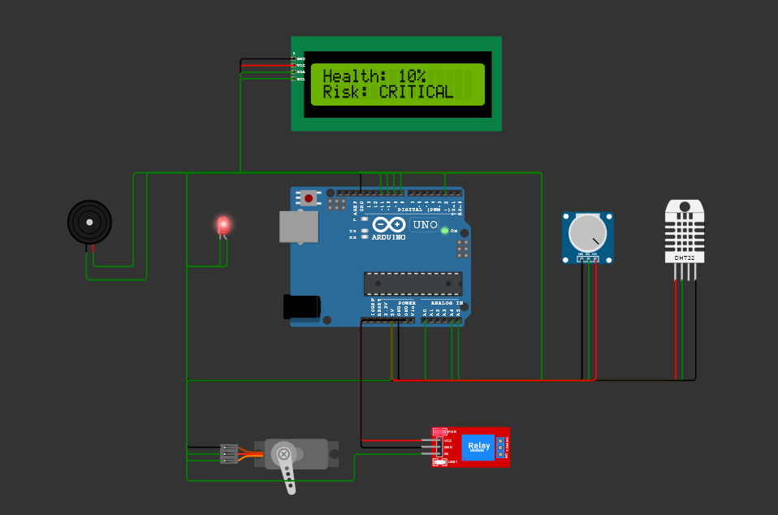

# Smart Transformer Health Monitoring and Preventive Protection System Using Arduino UNO

<p align="center">
  
</p>

---

<p align="center">


</p>

---

# Project Overview

The **Smart Transformer Health Monitoring and Preventive Protection System Using Arduino UNO** is an embedded systems project designed to continuously monitor transformer operating conditions and automatically perform preventive protection during abnormal situations.

The system measures transformer temperature using a **DHT22 Temperature Sensor** and simulates transformer loading using a **Potentiometer**. Based on these parameters, the Arduino UNO calculates a **Transformer Health Score**, classifies the transformer condition into different **Risk Levels**, and performs appropriate protection actions.

The system displays real-time information on a **16×2 I2C LCD** while protection devices including a **Servo Motor**, **Relay Module**, **LED**, and **Buzzer** respond automatically according to the transformer condition.

This project demonstrates practical applications of:

- Embedded Systems
- Arduino Programming
- Electrical Protection
- Sensor Interfacing
- Industrial Monitoring
- Preventive Protection Systems

---

# Objectives

- Monitor transformer temperature in real time.
- Monitor transformer load conditions.
- Calculate Transformer Health Score.
- Classify transformer operating risk.
- Provide visual and audible fault indications.
- Automatically activate cooling.
- Disconnect transformer during critical conditions.
- Display system status using LCD.
- Improve transformer operational safety.

---

# Key Features

| Feature | Description |
|----------|-------------|
| Real-Time Temperature Monitoring | Monitors transformer temperature using DHT22 |
| Load Monitoring | Simulates transformer load using potentiometer |
| Transformer Health Score | Calculates transformer operating condition |
| Risk Level Classification | Classifies transformer condition |
| Smart Preventive Protection | Automatically performs protection actions |
| Automatic Cooling | Activates servo motor during high temperature |
| Relay Protection | Disconnects transformer under critical conditions |
| LCD Dashboard | Displays live monitoring data |
| LED Warning | Provides visual indication |
| Buzzer Alert | Generates audible warning |
| Fault Counter | Counts abnormal operating conditions |

---

# Hardware Components

| Component | Quantity |
|-----------|----------|
| Arduino UNO | 1 |
| DHT22 Temperature Sensor | 1 |
| Potentiometer | 1 |
| 16×2 I2C LCD | 1 |
| Servo Motor | 1 |
| Relay Module | 1 |
| LED | 1 |
| Buzzer | 1 |
| Breadboard | 1 |
| Jumper Wires | As Required |
| USB Cable | 1 |

---

# Software Requirements

| Software | Purpose |
|----------|---------|
| Arduino IDE | Programming |
| KiCad | PCB Design |
| Git | Version Control |
| GitHub | Repository Hosting |

---

# Working Principle

1. DHT22 measures transformer temperature.
2. Potentiometer simulates transformer loading.
3. Arduino UNO reads both values.
4. Transformer Health Score is calculated.
5. Risk Level is determined.
6. LCD displays system status.
7. LED and Buzzer indicate warning conditions.
8. Servo activates cooling when required.
9. Relay disconnects transformer during critical conditions.
10. Fault Counter records abnormal events.````markdown
---

# Transformer Health Score Calculation

The **Transformer Health Score** represents the overall operating condition of the transformer based on the monitored parameters.

The Arduino UNO continuously evaluates:

- Transformer Temperature (DHT22)
- Simulated Load (Potentiometer)

Based on these values, the system determines the current health condition of the transformer. A higher health score indicates a healthy operating condition, while a lower score indicates increasing operational risk.

The calculated health score is used for:

- Real-Time Condition Monitoring
- Risk Level Classification
- Smart Preventive Protection
- Relay Protection Decision
- Cooling Control

---

# Risk Classification

| Health Condition | Risk Level | System Status |
|------------------|------------|---------------|
| Healthy | Low | Normal Operation |
| Moderate | Medium | Warning |
| Poor | High | Cooling Activated |
| Critical | Critical | Relay Protection Activated |

---

# Smart Preventive Protection

The system automatically performs preventive actions according to the transformer operating condition.

| Operating Condition | Automatic Action |
|----------------------|------------------|
| Normal | Continuous Monitoring |
| Warning | LED Warning |
| High Risk | Servo Cooling Activated |
| Critical | Servo Cooling + Relay OFF + LED + Buzzer |

This automatic protection mechanism helps reduce the possibility of transformer overheating and unsafe operating conditions.

---

# Block Diagram

<p align="center">
  
</p>

---

# Circuit Diagram

<p align="center">
  
</p>

---

# Flowchart

<p align="center">
  
</p>

---

# PCB Design

## Schematic

<p align="center">
  
</p>

## PCB Layout

<p align="center">
  
</p>

## PCB 3D View

<p align="center">
  
</p>

---

# Simulation

The simulation files and related documentation are available in the **Simulation** folder.

📁 **Simulation Folder:** [Simulation](./Simulation/)

For detailed simulation setup and execution steps, refer to:

- 📄 [Simulation README](./Simulation/README.md)

---

# LCD Dashboard

The **16×2 I2C LCD** provides a real-time user interface for monitoring the transformer's operating condition. It continuously updates the measured parameters and system status, enabling quick identification of abnormal conditions.

The LCD displays the following information:

| LCD Display | Description |
|-------------|-------------|
| Temperature | Current transformer temperature measured by the DHT22 sensor |
| Load | Simulated transformer load from the potentiometer |
| Health Score | Calculated Transformer Health Score |
| Risk Level | Current operating condition (Low, Medium, High, or Critical) |
| Cooling Status | Indicates whether the servo cooling mechanism is ON or OFF |
| Relay Status | Displays whether the relay is Connected or Disconnected |
| Fault Counter | Shows the total number of detected fault events |

The LCD automatically refreshes its display whenever the operating condition changes, allowing the user to monitor the transformer in real time.

---

# Experimental Results

The developed prototype was tested under different operating conditions by varying the simulated transformer load and temperature.

The experimental observations confirmed that the system successfully performs:

- Real-Time Temperature Monitoring
- Load Monitoring
- Transformer Health Score Calculation
- Risk Level Classification
- Automatic Cooling Control
- Relay-Based Protection
- LCD Status Display
- LED Warning Indication
- Buzzer Alert
- Fault Counting

The system responded correctly to changing operating conditions and activated the required protection mechanisms automatically.

---

# Test Results

| Test Case | Status |
|------------|--------|
| Temperature Monitoring | ✅ Passed |
| Load Monitoring | ✅ Passed |
| LCD Display | ✅ Passed |
| Transformer Health Score | ✅ Passed |
| Risk Classification | ✅ Passed |
| Servo Cooling | ✅ Passed |
| Relay Protection | ✅ Passed |
| LED Warning | ✅ Passed |
| Buzzer Alert | ✅ Passed |
| Fault Counter | ✅ Passed |

### Test Result 1

<p align="center">
  
</p>

### Test Result 2

<p align="center">
  
</p>

### Test Result 3

<p align="center">
  
</p>

### Test Result 4

<p align="center">
  
</p>

---

# Project Documentation

| Document | Description |
|----------|-------------|
| Abstract.md | Project Abstract |
| Methodology.md | Project Methodology |
| Project_Report.pdf | Complete Project Report |
| Smart_Transformer_Health_Monitoring_Presentation.pptx | Project Presentation |

---

# Repository Structure

```text
Smart-Transformer-Health-Monitoring-System/
│
├── Arduino_Code/
│   └── Smart_Transformer_Health_Monitoring.ino
│
├── Documentation/
│   ├── Abstract.md
│   ├── Methodology.md
│   ├── Project_Report.pdf
│   └── Smart_Transformer_Health_Monitoring_Presentation.pptx
│
├── Images/
│   ├── Project_Banner.png
│   ├── Block_Diagram.png
│   ├── Circuit_Diagram.png
│   ├── Flowchart.png
│   ├── LCD_Normal.png
│   ├── LCD_Status.png
│   ├── LCD_Prediction.png
│   └── LCD_Critical.png
│
├── KiCad/
│   ├── README.md
│   ├── Schematic.png
│   ├── PCB_Layout.png
│   ├── PCB_3D_View.png
│   ├── Smart Transformer Health Monitoring and Preventive Protection System.kicad_pro
│   ├── Smart Transformer Health Monitoring and Preventive Protection System.kicad_sch
│   └── Smart Transformer Health Monitoring and Preventive Protection System.kicad_pcb
│
├── Results/
│   ├── Test_Result.md
│   ├── Test_Result_1_Normal.png
│   ├── Test_Result_2_Status.png
│   ├── Test_Result_3_Prediction.png
│   └── Test_Result_4_Critical.png
│
├── Simulation/
│   └── README.md
│
├── LICENSE
└── README.md
```

---

# KiCad Folder Structure

```text
KiCad/
│
├── README.md
├── Schematic.png
├── PCB_Layout.png
├── PCB_3D_View.png
├── Smart Transformer Health Monitoring and Preventive Protection System.kicad_pro
├── Smart Transformer Health Monitoring and Preventive Protection System.kicad_sch
└── Smart Transformer Health Monitoring and Preventive Protection System.kicad_pcb
```

---

# Future Improvements

- Integrate voltage and current sensing modules.
- Support cloud-based data logging.
- Add Wi-Fi or GSM connectivity for remote monitoring.
- Develop a web dashboard for live monitoring.
- Store historical operating data using an SD card.
- Add additional transformer health parameters for enhanced monitoring.

---

# Conclusion

The **Smart Transformer Health Monitoring and Preventive Protection System Using Arduino UNO** provides an efficient embedded solution for transformer condition monitoring and protection. By combining real-time temperature monitoring, load monitoring, Transformer Health Score calculation, risk level classification, automatic cooling, relay-based protection, and fault indication, the system enhances transformer operational safety and reliability.

This project serves as an excellent educational and practical embedded systems project for applications in transformer monitoring and preventive protection.

---

# Author

**Karthikeyan M**

Department of Electrical and Electronics Engineering

**V.S.B College of Engineering Technical Campus**

Anna University

**Academic Year:** 2025–2026

---

# License

This project is licensed under the **MIT License**.

See the **LICENSE** file for more information.
