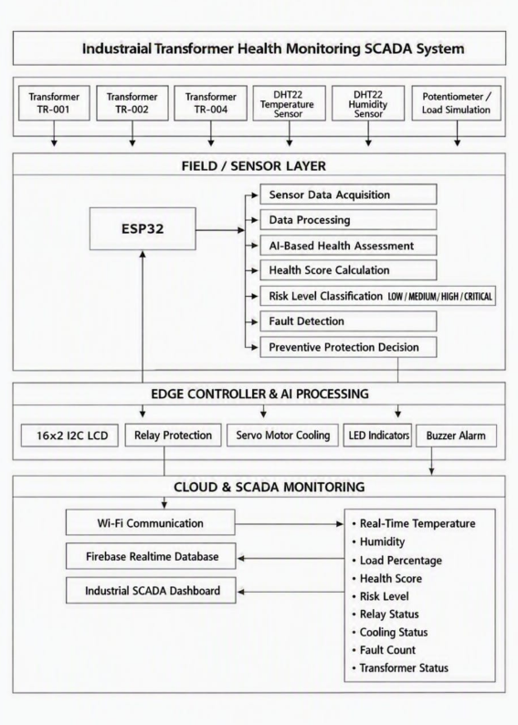
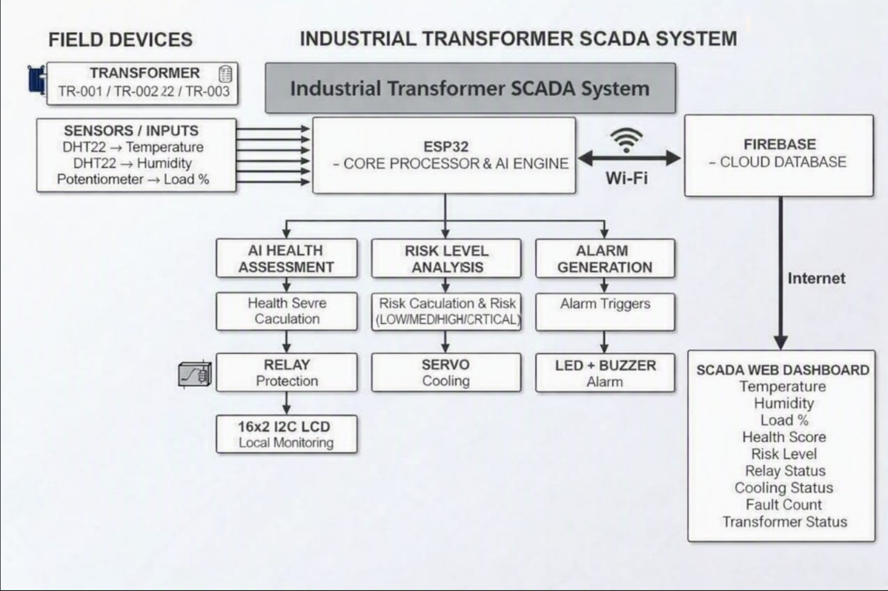
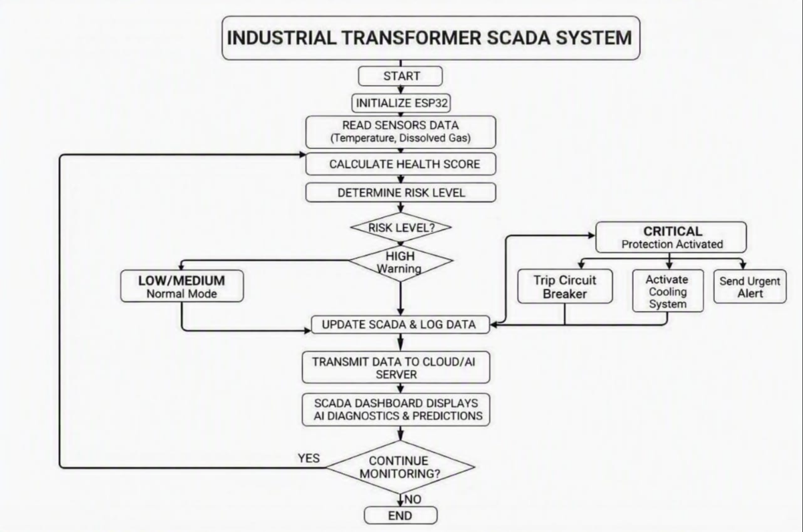

# Industrial Transformer Health Monitoring SCADA System

An ESP32-based industrial transformer health monitoring and preventive protection system designed for real-time condition monitoring, health assessment, risk classification, automatic protection, cloud data transmission, and remote SCADA visualization.

---

## Project Overview

The Industrial Transformer Health Monitoring SCADA System monitors important transformer operating parameters such as temperature, humidity, and load.

The ESP32 acts as the main processing and control unit. Sensor data is continuously acquired and processed to calculate a transformer health score and determine the corresponding risk level.

Based on the detected risk condition, the system can activate preventive protection mechanisms such as relay protection, servo-based cooling, LED indication, and buzzer alarm.

The monitored data is transmitted through Wi-Fi to Firebase, which acts as the cloud data layer for the SCADA web dashboard.

The overall system follows:

**Sensors → ESP32 → Health Assessment → Risk Analysis → Protection → Firebase → SCADA Dashboard**

---

## Objectives

- Monitor transformer operating parameters in real time.
- Monitor temperature and humidity using DHT22.
- Simulate transformer load using a potentiometer.
- Calculate an overall transformer health score.
- Classify transformer operating conditions into different risk levels.
- Provide automatic preventive protection during critical conditions.
- Control cooling using a servo motor.
- Control protection through a relay module.
- Generate visual and audible alarms.
- Transmit monitoring data to Firebase using Wi-Fi.
- Display transformer information through a remote SCADA web dashboard.
- Support monitoring of multiple transformer units.

---

## System Architecture

The system is divided into three major sections:

1. Field Devices
2. Data Processing and AI Core
3. Remote Monitoring and SCADA Interface



### Field Devices

The field section represents the monitored transformer units and their sensing parameters.

The system supports four transformer simulation units:

- TR-001
- TR-002
- TR-003
- TR-004

The monitored inputs include:

- Temperature
- Humidity
- Load Percentage

### Data Processing and AI Core

The ESP32 performs the main monitoring and decision-making operations.

The processing section includes:

- Sensor data acquisition
- Health score calculation
- Risk level analysis
- Alarm generation
- Relay protection
- Servo cooling control
- LCD monitoring

### Remote Monitoring and Interface

The ESP32 communicates with Firebase through Wi-Fi.

Firebase stores the monitoring information, which is then used by the SCADA web dashboard for remote visualization.

The dashboard displays:

- Temperature
- Humidity
- Load Percentage
- Health Score
- Risk Level
- Relay Status
- Cooling Status
- Alarm Status
- Fault Count
- Transformer Status

---

## Block Diagram

The block diagram represents the overall functional structure of the Industrial Transformer Health Monitoring SCADA System.



The main data flow is:

**Transformer → Sensors → ESP32 → Health Assessment → Risk Analysis → Protection → Firebase → SCADA Dashboard**

---

## System Flowchart

The flowchart represents the complete monitoring and preventive protection sequence.



The basic operating sequence is:

1. Start the system.
2. Initialize ESP32 and connected devices.
3. Establish Wi-Fi connection.
4. Read temperature, humidity, and load values.
5. Process the sensor values.
6. Calculate the transformer health score.
7. Determine the risk level.
8. Update the local LCD display.
9. Activate required protection and warning mechanisms.
10. Send monitoring data to Firebase.
11. Display the received data on the SCADA dashboard.
12. Continue monitoring continuously.

---

## Circuit Diagram

The circuit diagram shows the ESP32-based hardware implementation used for the monitoring and protection system.


### Main Hardware Components

| Component | Function |
|---|---|
| ESP32 | Main controller and Wi-Fi communication |
| DHT22 | Temperature and humidity measurement |
| Potentiometer | Transformer load simulation |
| 16×2 I2C LCD | Local monitoring display |
| Relay Module | Preventive protection |
| Servo Motor | Cooling mechanism |
| LED | Visual warning indication |
| Buzzer | Audible alarm indication |

---

## Hardware and Software

### Hardware

- ESP32
- DHT22 Temperature and Humidity Sensor
- Potentiometer
- 16×2 I2C LCD
- Relay Module
- Servo Motor
- LED
- Buzzer
- Resistor
- Connecting Wires

### Software and Platforms

- Arduino IDE
- Wokwi Simulator
- Firebase
- HTML
- CSS
- JavaScript
- SCADA Web Dashboard
- GitHub

---

## Monitoring Parameters

| Parameter | Source | Purpose |
|---|---|---|
| Temperature | DHT22 | Transformer thermal condition |
| Humidity | DHT22 | Environmental/insulation monitoring |
| Load | Potentiometer | Load percentage simulation |
| Health Score | ESP32 | Overall transformer condition |
| Risk Level | ESP32 | Transformer risk classification |
| Relay Status | ESP32 | Protection status |
| Cooling Status | Servo | Cooling operation |
| Alarm Status | LED + Buzzer | Abnormal condition indication |
| Fault Count | ESP32 | Critical fault tracking |
| Transformer Status | ESP32/Firebase | Overall operating condition |

---

## Health Assessment

The ESP32 processes the monitored transformer parameters and calculates a health score.

The health score represents the overall operating condition of the transformer.

A higher health score represents a healthier operating condition, while a lower score indicates increasing operational risk.

---

## Risk Classification

The transformer condition is classified based on the calculated health score.

| Health Score | Risk Level | System Response |
|---|---|---|
| 80–100 | LOW | Normal Monitoring |
| 50–79 | MEDIUM | Warning Monitoring |
| 25–49 | HIGH | Warning / Preventive Action |
| Below 25 | CRITICAL | Protection Activated |

---

## Preventive Protection

When the transformer reaches a critical condition, the system automatically activates preventive protection mechanisms.

### Critical Condition Response

- Relay protection is activated.
- Servo motor operates as a cooling mechanism.
- LED warning is activated.
- Buzzer alarm is activated.
- LCD displays the updated transformer condition.
- Firebase receives the updated status.
- SCADA dashboard displays the critical condition.

This provides an automated response to abnormal transformer operating conditions.

---

## Firebase Communication

The ESP32 communicates with Firebase through Wi-Fi.

Firebase acts as the cloud data layer between the ESP32 monitoring system and the SCADA web dashboard.

The system can transmit parameters such as:

- Temperature
- Humidity
- Load Percentage
- Health Score
- Risk Level
- Relay Status
- Cooling Status
- Alarm Status
- Fault Count
- Transformer Status

The SCADA dashboard retrieves the stored monitoring information and presents it through a web-based interface.

---

## SCADA Dashboard

The SCADA web dashboard provides remote visualization of transformer operating conditions.

The dashboard includes:

- Real-Time Temperature
- Humidity
- Load Percentage
- Health Score
- Risk Level
- Relay Status
- Cooling Status
- Alarm Status
- Fault Count
- Transformer Status

The interface is designed for industrial-style monitoring and provides a centralized view of transformer health and protection status.

---

## Simulation

The system was tested using four individual transformer simulation instances.

### Transformer Simulations

| Transformer | Simulation |
|---|---|
| TR-001 | [Open TR-001 Simulation](https://wokwi.com/projects/472072364712871937) |
| TR-002 | [Open TR-002 Simulation](https://wokwi.com/projects/471997864432481281) |
| TR-003 | [Open TR-003 Simulation](https://wokwi.com/projects/471997923499829249) |
| TR-004 | [Open TR-004 Simulation](https://wokwi.com/projects/471997982880700417) |

Each simulation represents an individual transformer monitoring unit.

---

## Simulation Test Conditions

### Normal Condition

Under normal operating conditions:

- Temperature remains within the safe operating range.
- Load remains at a normal level.
- Health score remains high.
- Risk level remains LOW.
- Relay protection remains normal.
- Cooling remains inactive.
- Alarm remains OFF.

### Warning Condition

When temperature or load increases:

- Health score decreases.
- Risk level increases.
- Warning indication is generated.
- LCD displays the updated condition.
- Monitoring data is updated.

### Critical Condition

When transformer operating conditions reach a critical level:

- Critical risk is detected.
- Relay protection is activated.
- Servo cooling is activated.
- LED turns ON.
- Buzzer turns ON.
- Firebase data is updated.
- SCADA dashboard displays the critical condition.

---

## Simulation Documentation

Detailed simulation information is available in:

[Simulation Details](Documentation/Simulation_Details.md)

---

## Project Documentation

| Document | Description |
|---|---|
| [Block Diagram](Documentation/Block_Diagram.png) | Overall functional system structure |
| [Circuit Diagram](Documentation/Circuit_Diagram.png) | ESP32 hardware connections |
| [Flowchart](Documentation/FlowChart.png) | Monitoring and protection workflow |
| [System Architecture](Documentation/System_Architecture.png) | Complete system architecture |
| [Simulation Details](Documentation/Simulation_Details.md) | Simulation methodology and results |

---

## Project Workflow

The complete system workflow is:

```text
Transformer
     ↓
DHT22 + Load Input
     ↓
ESP32
     ↓
Sensor Data Processing
     ↓
Health Score Calculation
     ↓
Risk Level Classification
     ↓
┌─────────────────────────────┐
│ LOW / MEDIUM / HIGH /       │
│ CRITICAL                    │
└─────────────────────────────┘
     ↓
Preventive Protection
     ↓
Relay + Servo + LED + Buzzer
     ↓
Firebase
     ↓
SCADA Web Dashboard
     ↓
Remote Transformer Monitoring


Applications

The system can be used as a prototype for:

Transformer condition monitoring
Industrial equipment monitoring
Preventive protection systems
Remote electrical asset monitoring
IoT-based electrical monitoring
SCADA-based equipment supervision
Smart substation monitoring concepts
Future Enhancements

The system can be further enhanced by integrating:

Current and voltage sensors
Transformer oil temperature monitoring
Oil level monitoring
Vibration monitoring
Power factor monitoring
Energy measurement
Historical trend analysis
Advanced predictive maintenance algorithms
Multiple transformer dashboards
Mobile monitoring
Automated maintenance alerts
Advanced machine learning models
Conclusion

The Industrial Transformer Health Monitoring SCADA System demonstrates the integration of embedded monitoring, preventive protection, cloud communication, and remote SCADA visualization.

The ESP32 collects transformer operating parameters, processes the data, calculates the health condition, determines the risk level, and activates appropriate protection mechanisms.

Firebase provides the cloud communication layer, while the SCADA web dashboard provides remote visualization of the transformer condition.

The four transformer simulations, TR-001, TR-002, TR-003, and TR-004, demonstrate how the monitoring concept can be extended to multiple transformer units.

The overall system demonstrates the following architecture:

Field Sensors → ESP32 → Health Assessment → Risk Classification → Preventive Protection → Firebase → SCADA Dashboard

Author

Karthikeyan M

Electrical and Electronics Engineering

Industrial Transformer Health Monitoring SCADA System


### GitHub folder structure


Make sure your repository looks like this:


```text
AI-Based-Transformer-Health-Monitoring-System/
│
├── Documentation/
│   ├── Block_Diagram.png
│   ├── Circuit_Diagram.png
│   ├── FlowChart.png
│   ├── System_Architecture.png
│   └── Simulation_Details.md
│
├── Dashboard/
├── Images/
├── Simulation/
├── simulator/
├── README.md
└── ...
