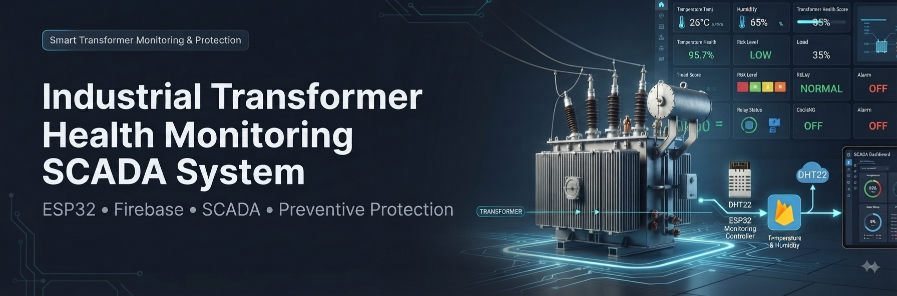

# Industrial Transformer Health Monitoring SCADA System

An ESP32-based transformer health monitoring and preventive protection system with Firebase cloud communication and an industrial SCADA web dashboard.

# Industrial Transformer Health Monitoring SCADA System

An ESP32-based transformer health monitoring and preventive protection system with Firebase cloud communication and an industrial SCADA web dashboard.

The system monitors transformer temperature, humidity, and load conditions, processes the collected parameters using ESP32, calculates a transformer health score, classifies the transformer risk level, and activates preventive protection during critical operating conditions.

The system also supports multi-transformer monitoring through separate simulation units and provides remote monitoring through a Firebase-connected SCADA web dashboard.

---

## Project Overview

Transformer health monitoring is important for identifying abnormal operating conditions before they develop into serious faults.

This project demonstrates a smart monitoring and preventive protection approach using ESP32, DHT22, load simulation, relay protection, servo-based cooling, local LCD monitoring, Firebase cloud communication, and an industrial SCADA web dashboard.

The system continuously monitors transformer-related parameters and converts the collected information into an easy-to-understand health and risk status.

The overall monitoring workflow is:

**Sensors → ESP32 → Health Assessment → Risk Classification → Preventive Protection → Firebase → SCADA Dashboard**

---

## Key Features

- Real-time transformer condition monitoring
- Temperature monitoring
- Humidity monitoring
- Load percentage monitoring
- Transformer health score calculation
- LOW, MEDIUM, HIGH, and CRITICAL risk classification
- Automatic preventive protection
- Relay-based protection control
- Servo-based cooling control
- LED warning indication
- Buzzer alarm indication
- 16×2 I2C LCD monitoring
- ESP32-based processing
- Wi-Fi communication
- Firebase cloud communication
- Industrial SCADA web dashboard
- Remote transformer status monitoring
- Multi-transformer monitoring
- Separate simulation units for TR-001, TR-002, TR-003, and TR-004

---

## System Architecture

The system is designed as a layered monitoring and protection architecture.

Transformer operating parameters are collected from the monitoring inputs and processed by the ESP32. The ESP32 evaluates the transformer condition, calculates the health score, determines the risk level, and controls the protection devices.

The processed monitoring information is transmitted through Wi-Fi to Firebase. The SCADA web dashboard retrieves the cloud data and provides centralized remote visualization.


---

## Block Diagram

The block diagram represents the major functional units of the transformer monitoring and preventive protection system.


---

## Flowchart

The flowchart represents the operating sequence from system initialization and sensor data acquisition to health assessment, risk classification, protection control, Firebase communication, and SCADA monitoring.


---

## Circuit Diagram

The circuit diagram represents the ESP32-based hardware connections used for transformer monitoring, local display, alarm indication, cooling control, and preventive protection.


---

## Hardware Components

| Component | Function |
|---|---|
| ESP32 | Main controller, data processing, Wi-Fi and Firebase communication |
| DHT22 | Temperature and humidity monitoring |
| Potentiometer | Transformer load percentage simulation |
| 16×2 I2C LCD | Local transformer monitoring and status display |
| Relay Module | Preventive protection control |
| Servo Motor | Automatic cooling mechanism |
| LED | Visual warning indication |
| Buzzer | Audible alarm indication |

---

## Hardware Functions

### ESP32

The ESP32 acts as the central controller of the system. It collects sensor values, processes transformer operating parameters, calculates the health score, determines the risk level, controls protection devices, and communicates monitoring data to Firebase through Wi-Fi.

### DHT22

The DHT22 sensor provides temperature and humidity measurements used for transformer condition monitoring.

### Potentiometer

The potentiometer is used as a simulated load input. Its value represents the transformer load percentage during the simulation.

### 16×2 I2C LCD

The LCD provides local monitoring of important transformer parameters and operating status.

### Relay Module

The relay provides a control mechanism for preventive protection during critical transformer conditions.

### Servo Motor

The servo motor represents an automatic cooling mechanism that operates according to the transformer risk condition.

### LED

The LED provides a visual warning indication when abnormal or critical conditions are detected.

### Buzzer

The buzzer provides an audible alarm during abnormal and critical operating conditions.

---

## Technologies Used

- ESP32
- Arduino IDE
- DHT22
- 16×2 I2C LCD
- Potentiometer
- Relay Module
- Servo Motor
- LED
- Buzzer
- Wi-Fi
- Firebase
- HTML
- CSS
- JavaScript
- SCADA Web Dashboard
- Wokwi Simulation

---

## Monitoring Parameters

The system monitors the following parameters:

| Parameter | Source | Purpose |
|---|---|---|
| Temperature | DHT22 | Transformer thermal condition |
| Humidity | DHT22 | Environmental monitoring |
| Load Percentage | Potentiometer | Transformer load simulation |
| Health Score | ESP32 | Overall transformer condition |
| Risk Level | ESP32 | Transformer condition classification |
| Relay Status | ESP32 | Preventive protection status |
| Cooling Status | Servo | Cooling mechanism status |
| Alarm Status | LED + Buzzer | Warning and critical indication |
| Fault Count | ESP32 | Critical fault tracking |
| Transformer Status | ESP32 / Firebase | Overall operating condition |

---

## Health and Risk Classification

The transformer condition is classified using the calculated health score.

| Health Score | Risk Level | System Response |
|---|---|---|
| 80–100 | LOW | Normal Monitoring |
| 50–79 | MEDIUM | Warning Monitoring |
| 25–49 | HIGH | Preventive Action |
| Below 25 | CRITICAL | Protection Activated |

The health score provides a simplified representation of the transformer operating condition and allows the system to classify the current risk level.

---

## Preventive Protection

The system is designed to respond automatically when a critical transformer condition is detected.

During a critical condition:

- Relay protection is activated.
- Servo-based cooling is activated.
- LED warning indication is enabled.
- Buzzer alarm is activated.
- LCD status is updated.
- Transformer status is updated in Firebase.
- SCADA dashboard displays the updated protection condition.

This provides an automated preventive response instead of relying only on manual monitoring.

---

## Firebase Cloud Communication

The ESP32 communicates with Firebase using Wi-Fi.

Firebase acts as the cloud data layer between the ESP32 monitoring system and the SCADA web dashboard.

The monitoring data transmitted to Firebase can include:

- Temperature
- Humidity
- Load Percentage
- Health Score
- Risk Level
- Relay Status
- Cooling Status
- Alarm Status
- Fault Count
- Transformer Status

The SCADA dashboard uses the Firebase data to provide centralized remote monitoring.

---

## SCADA Web Dashboard

The industrial SCADA web dashboard provides a centralized interface for monitoring transformer operating conditions.

The dashboard can display:

- Real-time Temperature
- Humidity
- Load Percentage
- Health Score
- Risk Level
- Relay Status
- Cooling Status
- Alarm Status
- Fault Count
- Transformer Status

The dashboard is designed to provide a clear view of transformer health and protection status.

The multi-transformer configuration allows separate transformer units to be monitored from a centralized SCADA interface.

---

## Multi-Transformer Simulation

The project includes four separate transformer simulation units.

### TR-001

[View TR-001 Wokwi Simulation](https://wokwi.com/projects/472072364712871937)

### TR-002

[View TR-002 Wokwi Simulation](https://wokwi.com/projects/471997864432481281)

### TR-003

[View TR-003 Wokwi Simulation](https://wokwi.com/projects/471997923499829249)

### TR-004

[View TR-004 Wokwi Simulation](https://wokwi.com/projects/471997982880700417)

These simulation units demonstrate the monitoring concept for multiple transformer units.

---

## Simulation Conditions

The system can be evaluated under different operating conditions by changing the temperature and load inputs.

### Normal Condition

Under normal operating conditions:

- Health score remains high.
- Risk level remains LOW.
- Relay protection remains inactive.
- Cooling remains inactive.
- Alarm indication remains OFF.
- Transformer status remains normal.

### Warning Condition

When temperature or load increases:

- Health score decreases.
- Risk level changes to MEDIUM or HIGH depending on the calculated condition.
- Warning indication is generated.
- LCD displays the updated condition.
- Monitoring information is updated in the cloud dashboard.

### Critical Condition

When the transformer operating condition reaches a critical level:

- Risk level becomes CRITICAL.
- Relay protection is activated.
- Servo cooling is activated.
- LED warning is activated.
- Buzzer alarm is activated.
- Firebase data is updated.
- SCADA dashboard displays the critical transformer condition.
---
## Advantages

- Continuous transformer condition monitoring
- Real-time temperature and humidity monitoring
- Load condition monitoring
- Automatic transformer health assessment
- Automatic risk classification
- Preventive protection response
- Automatic cooling control
- Local LCD monitoring
- LED and buzzer warning indication
- Firebase cloud communication
- Remote SCADA monitoring
- Centralized multi-transformer monitoring
- Real-time transformer status visualization
- Expandable monitoring architecture
- Suitable as a prototype for smart transformer monitoring applications

---

## Future Scope

The system can be further developed by integrating additional transformer parameters and advanced monitoring technologies.

- Transformer oil temperature monitoring
- Transformer oil level monitoring
- Transformer current and voltage monitoring
- Transformer vibration monitoring
- Power factor monitoring
- Energy monitoring
- Historical transformer data analysis
- Real-time trend analysis
- Advanced predictive maintenance algorithms
- Machine learning-based fault prediction
- Automated fault classification
- Mobile monitoring application
- Large-scale multi-transformer SCADA deployment
- Industrial communication protocol integration
- Advanced alarm and event management
- Remote diagnostic support

---

## Conclusion

The Industrial Transformer Health Monitoring SCADA System demonstrates an integrated approach to transformer condition monitoring and preventive protection using ESP32, sensors, protection devices, Firebase cloud communication, and an industrial SCADA web dashboard.

The ESP32 collects transformer operating parameters and processes the collected information to determine the transformer health condition and risk level. Based on the detected condition, the system provides warning indications and automatically activates preventive protection during critical operating conditions.

Firebase provides the cloud communication layer, while the SCADA web dashboard provides centralized remote visualization of transformer operating parameters and protection status.

The multi-transformer simulation using TR-001, TR-002, TR-003, and TR-004 demonstrates the possibility of extending the system to multiple transformer monitoring units.

The complete system workflow is:

**Sensors → ESP32 → Health Assessment → Risk Classification → Preventive Protection → Firebase → SCADA Dashboard**

---

## Author

**Karthikeyan M**

B.E. Electrical and Electronics Engineering  
V.S.B College of Engineering Technical Campus  
2023–2027

---
## Project Structure

```text
AI-Based-Transformer-Health-Monitoring-System/
│
├── Arduino_Code/
│   └── Smart_Transformer_Health_Monitoring.ino
│
├── Dashboard/
│   ├── index.html
│   ├── style.css
│   └── script.js
│
├── Documentation/
│   ├── Block_Diagram.png
│   ├── Circuit_Diagram.png
│   ├── Flowchart.png
│   ├── System_Architecture.png
│   └── Simulation_Details.md
│
├── Images/
│   ├── Block_Diagram.png
│   ├── Circuit_Diagram.png
│   ├── Flowchart.png
│   └── System_Architecture.png
│
├── Simulation/
│   ├── TR-001
│   ├── TR-002
│   ├── TR-003
│   └── TR-004
│
├── simulator/
│   └── firebase-config.js
│
├── README.md
└── LICENSE


