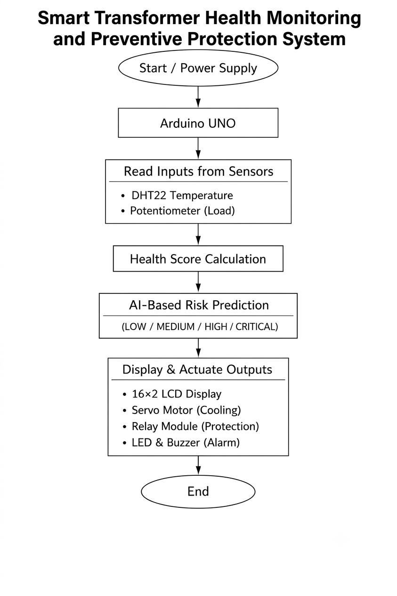
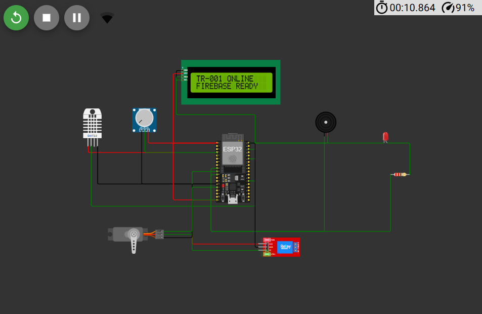

# Industrial Transformer Health Monitoring SCADA System

An ESP32-based transformer health monitoring and preventive protection system with Firebase cloud communication and an industrial SCADA web dashboard.

The system monitors transformer temperature, humidity, and load conditions, calculates a transformer health score, classifies the transformer risk level, and activates preventive protection during critical conditions.

---

## Key Features

- Real-time transformer condition monitoring
- Temperature and humidity monitoring
- Load percentage monitoring
- Transformer health score calculation
- LOW, MEDIUM, HIGH, and CRITICAL risk classification
- Automatic relay-based protection
- Servo-based cooling control
- LED warning indication
- Buzzer alarm indication
- 16×2 I2C LCD monitoring
- Wi-Fi communication
- Firebase cloud communication
- Industrial SCADA web dashboard
- Multi-transformer monitoring
- Remote transformer status visualization

---

## System Architecture

The complete system follows the architecture:

**DHT22 + Load Input → ESP32 → Health Assessment → Risk Classification → Preventive Protection → Firebase → SCADA Dashboard**

---

## Block Diagram

---

## Flowchart

---

## Circuit Diagram

---

## Hardware Components

- ESP32
- DHT22 Temperature and Humidity Sensor
- Potentiometer for Load Simulation
- 16×2 I2C LCD
- Relay Module
- Servo Motor
- LED
- Buzzer

---

## Hardware Functions

| Component | Function |
|---|---|
| ESP32 | Main controller and data processing unit |
| DHT22 | Temperature and humidity monitoring |
| Potentiometer | Transformer load percentage simulation |
| 16×2 I2C LCD | Local transformer status display |
| Relay Module | Preventive protection control |
| Servo Motor | Automatic cooling control |
| LED | Visual warning indication |
| Buzzer | Audible alarm indication |

---

## Technologies Used

- ESP32
- Arduino IDE
- Wi-Fi
- Firebase
- HTML, CSS, JavaScript
- SCADA Web Dashboard
- Wokwi Simulation

---

## Risk Classification

| Health Score | Risk Level | System Response |
|---|---|---|
| 80–100 | LOW | Normal Monitoring |
| 50–79 | MEDIUM | Warning Monitoring |
| 25–49 | HIGH | Preventive Action |
| Below 25 | CRITICAL | Protection Activated |

---

## Multi-Transformer Simulation

- **TR-001:** [View Simulation](https://wokwi.com/projects/472072364712871937)
- **TR-002:** [View Simulation](https://wokwi.com/projects/471997864432481281)
- **TR-003:** [View Simulation](https://wokwi.com/projects/471997923499829249)
- **TR-004:** [View Simulation](https://wokwi.com/projects/471997982880700417)

---
## Project Structure

AI-Based-Transformer-Health-Monitoring-System/
│
├── Arduino_Code/
│   └── Smart_Transformer_Health_Monitoring.ino
│
├── Dashboard/
│   ├── index.html
│   ├── style.css
│   └── script.js
│
├── Documentation/
│   ├── Block_Diagram.png
│   ├── Circuit_Diagram.png
│   ├── Flowchart.png
│   ├── System_Architecture.png
│   └── Simulation_Details.md
│
├── Images/
│   ├── Block_Diagram.png
│   ├── Circuit_Diagram.png
│   ├── Flowchart.png
│   └── System_Architecture.png
│
├── Simulation/
│   ├── TR-001
│   ├── TR-002
│   ├── TR-003
│   └── TR-004
│
├── simulator/
│   └── firebase-config.js
│
├── README.md
└── LICENSE
---
## Advantages

- Continuous transformer condition monitoring
- Automatic health assessment
- Automatic risk classification
- Preventive protection response
- Automatic cooling control
- Local LCD monitoring
- Cloud-based data communication
- Remote SCADA monitoring
- Centralized multi-transformer monitoring
- Real-time transformer status visualization
- Expandable monitoring architecture
- Suitable for smart transformer monitoring applications

---

## Future Scope

The system can be further developed by integrating additional transformer parameters and advanced predictive maintenance technologies:

- Transformer oil temperature & level monitoring
- Transformer current, voltage, and vibration monitoring
- Power factor and Energy monitoring
- Historical data analysis and Real-time trend analysis
- Machine learning-based fault prediction & automated classification
- Mobile monitoring application
- Large-scale multi-transformer SCADA deployment
- Industrial communication protocol integration
- Advanced alarm, event management, and remote diagnostic support

---

## Conclusion

The Industrial Transformer Health Monitoring SCADA System demonstrates an integrated approach to transformer condition monitoring and preventive protection. The ESP32 collects operating parameters and processes the information to determine the transformer health condition and risk level. Based on the detected condition, the system provides warning indications and automatically activates preventive protection during critical conditions. The integration of embedded monitoring, cloud communication, and SCADA visualization provides a scalable foundation for smart transformer monitoring applications.

**System Workflow:**
> Sensors → ESP32 → Health Assessment → Risk Classification → Preventive Protection → Firebase → SCADA Dashboard

---

## Project Author

**Karthikeyan M**  
B.E. Electrical and Electronics Engineering  
V.S.B College of Engineering Technical Campus  
2023–2027
